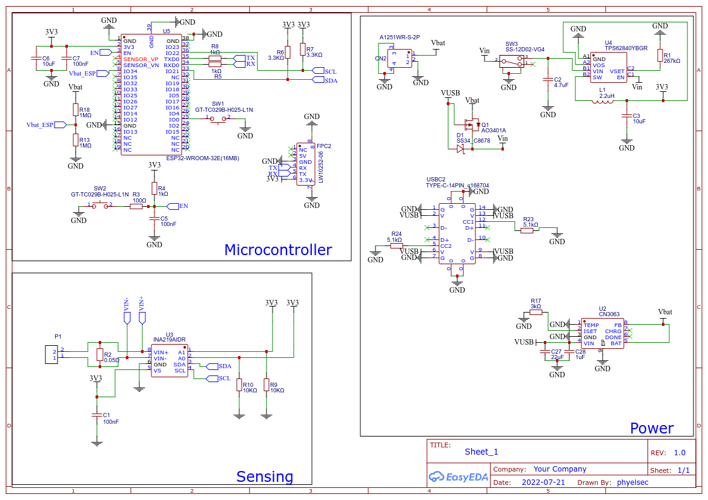
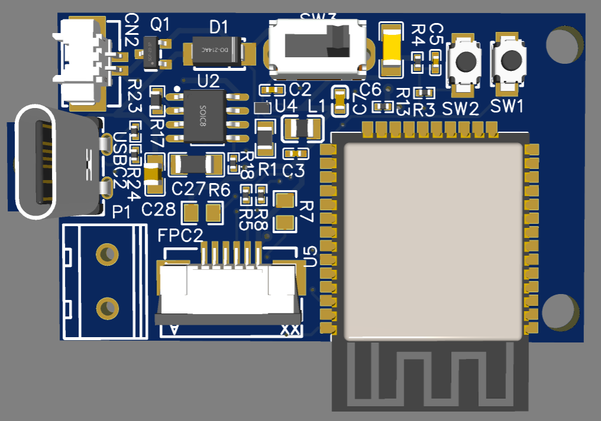
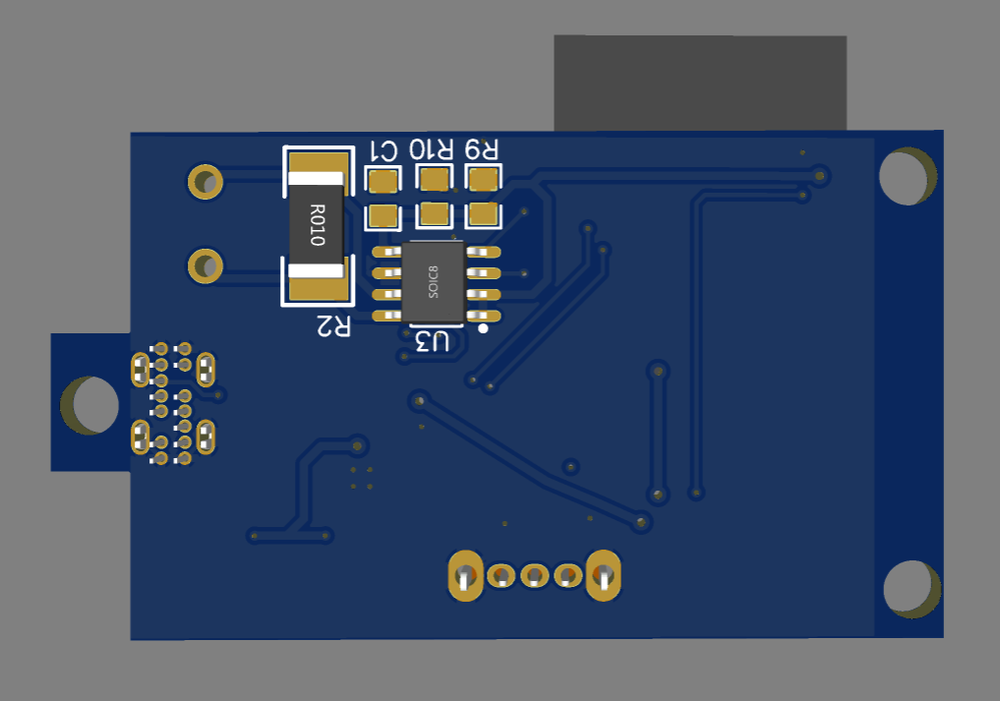
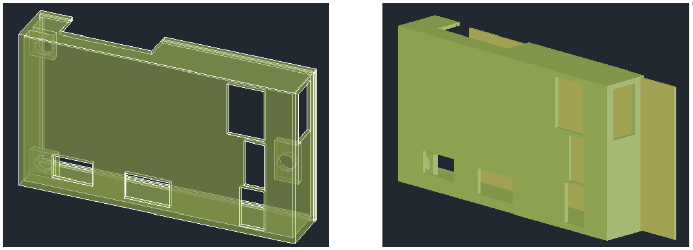

# Current and Voltage Meter

Battery-powered electronic circuit that wirelessly measures and transmits the voltages and currents generated by two solar panels used to power an LED-illuminated plant growth system.

> Download the full [report](./Current_Voltage_Meter_Spanish.pdf)

## Content
- [Operation Mode](README.md#operation-mode)
- [Schematic](README.md#schematic)
- [PCB](README.md#pcb)

### Operation Mode
- Detection system that can measure voltages up to 25 [V] and currents up to 5 [A].
- Operating time range 9:00 AM - 4:00 PM.
- The system senses current 3 times during the first 15 minutes of each hour, the remaining 45 minutes it enters deep sleep mode..

### Schematic
Main components:
- **`INA219AIDR` current sensor** from *Texas Instruments*
- **`ESP32-WROOM-32E` microcontroller** from *Expressif*
- **`TPS62840` DC-DC converter** from *Texas Instruments*

### PCB
- **EDA Tool**: EasyEDA
- **Board Dimensions** : `36.40mm x 44.95mm`
- **Power Tracks `Vin, 3.3V, Vbat, Vin+, Vin-` widths** : min `0.3mm`, max `0.5mm`
- **Signal Processing Tracks Widths** : min `0.254mm`
- **Track Spacing** : `0.4mm`
- **Top View** : Power and processing blocks.
- **Bottom View** : Sensing blocks.

> Download the [gerber files](./Gerber/)

#### Top View

#### Bottom View

#### Casing

